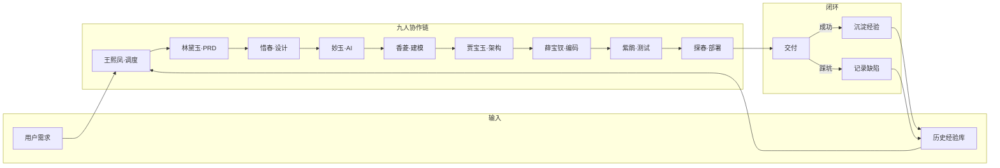

# 红楼智数专家团 · RedChamber-Swarm

[](LICENSE)
[](#)
[](#changelog)
[](#)
[](#mcp-server)
[](#spring-ai)
[](#自进化记忆库)

> 9 位红楼角色扮演的全栈 AI 开发团队 —— 从 PRD 到 DevOps 全链路 SOP 协作，内建自进化记忆库与 MCP 工具链。

---

## 一句话

把一次性的 AI 编码助手，变成一支**有记忆、会复盘、按 SOP 协作**的 9 人专家团。

---

## 运行机制



---

## 核心特性

| 特性 | 说明 |
|------|------|
| **9 角色 SOP 协作** | 王熙凤调度，林黛玉写 PRD，贾宝玉做架构，薛宝钗编码，紫鹃测试，探春部署 —— 各司其职，按序流转 |
| **自进化记忆库** | `learnings/` 目录持久化成功模式 (SP)、踩坑记录 (BC)、进化规约 (EP)，跨会话传承经验，16/16 evals 全过 |
| **MCP Server** | 5 个工具暴露为 MCP 协议，Codex / Claude Desktop / Cursor 均可调用 |
| **5 种敏捷战队** | AI-RAG · 算法建模 · 安全加固 · AI-Agent · MCP Server —— 按需裁剪 SOP，仅激活最小子团队 |
| **Spring AI 原生支持** | 架构师、工程师、AI 工程师已植入 Spring AI 1.x 全栈能力，MCP 提供一键规范速查 |
| **企业级安全** | 内建 4A 鉴权、RLS 行级隔离、敏感数据脱敏、防 Prompt 注入 |
| **2026 技术理念** | A2A 协议 · Human-on-the-Loop · Agentic RAG · GraphRAG · Computer Use · AgentOps · MCP 2026 无状态协议 |
| **防退化测试** | QA 每次变更以历史 Bad Cases 为阻击集回归验证，防止旧 Bug 复发 |
| **多平台** | WorkBuddy 原生专家团、Codex 插件、CodeBuddy、Cursor、Claude Desktop、网页端 AI 全支持 |

---

## 快速开始

### Codex（推荐）

项目已注册为 Codex 插件，加载后自动激活 Skill 和 MCP Server，5 个 MCP 工具立即可用。

### WorkBuddy

在专家中心导入 `plugin/plugin.json`，一键激活 9 角色协作。

### Claude Desktop

在 MCP 配置中添加本项目路径，即可调用 5 个 MCP 工具。

### 网页端 AI

复制 [`prompts/universal_bootstrap.md`](prompts/universal_bootstrap.md) 全文发送给 ChatGPT / Claude / DeepSeek / Kimi 等，AI 会自动模拟王熙凤的心智调度团队。

---

## MCP Server

| 工具 | 功能 |
|------|------|
| `sop_phase_check` | 检查项目 SOP 各阶段完成状态，自动建议下一阶段 |
| `learnings_search` | 按关键词检索学习库（成功模式 / 踩坑 / 进化规约） |
| `workflow_route` | 根据需求自动判断工作流类型（快速 / BugFix / SOP / Spring AI 等） |
| `team_role_info` | 查询 9 位角色详情或单 Agent 直调路由 |
| `spring_ai_guide` | Spring AI 架构 / 编码 / 方案设计规范速查 |

---

## 自动化脚本

```bash
# 从 git log 自动提取经验条目
python scripts/learnings_summary.py --dry-run

# 检查 SOP 阶段状态
python scripts/check_sop_phase.py --list
```

---

## 项目结构

```
├── agents/                 9 个角色定义（扁平 frontmatter）
├── avatars/                角色头像
├── learnings/              自进化记忆库 (SP/BC/EP + 版本快照)
├── mcp_server/             MCP Server 实现（5 个工具）
├── scripts/                自动化脚本
├── skills/                 团队协作 Skill
│   ├── dream-team-workflow/   多 Agent 调度版（evals + scripts + learnings）
│   └── red-chamber-codex/     Codex 单 Agent 版
├── plugin/                 plugin.json（权威源）
├── .codebuddy-plugin/      CodeBuddy 适配（与权威源 MD5 一致）
├── .workbuddy-plugin/      WorkBuddy 适配（与权威源 MD5 一致）
├── .mcp.json               MCP 注册配置
├── _shared/                公共规则核心（team-core.md）
├── AGENTS.md               协作铁律（四条正则 + 五条红线 + 路由表）
├── CLAUDE.md               Claude 系指引
└── README.md
```

---

## 技术栈

| 领域 | 支持 |
|------|------|
| 后端 | Python (FastAPI) · Java (Spring Boot 3.x + Spring AI 1.x) · Go · Node.js |
| 前端 | React · Vue · Svelte · Next.js |
| AI/ML | LangChain · LangGraph · AutoGen · FastMCP · PyTorch |
| 向量存储 | pgvector · Redis Stack · Milvus · Chroma |
| 安全 | Spring Security · OAuth2 · JWT · 4A · RLS |
| 部署 | Docker · Kubernetes · CI/CD |

---

## Changelog

| 版本 | 日期 | 要点 |
|------|------|------|
| v1.9.4 | 2026-07-31 | 第八轮审计：server.py WORKFLOW_RULES 改用 regex 匹配（修复通配符语义丢失 + human-in-the-loop 空格变体漏匹配）；route_workflow.py 死代码大写关键词修正（4A/SSO/RBAC/ABAC/HITL → 小写）；team-core.md 补 4 章节（274→325 行）；red-chamber-codex/SKILL.md 补 3 章节（284→323 行）；章节覆盖率 100% |
| v1.9.3 | 2026-07-30 | 第六轮审计：server.py 关键词与 route_workflow.py 10 组精确对齐；三份 plugin.json 统一；red-chamber-codex/SKILL.md 补 8 章节（153→284 行）；team-core.md 补 5 敏捷战队+管理章节（194→274 行） |
| v1.9.2 | 2026-07-30 | 第五轮审计：路由优先级守卫（has_large_scale）；角色构建改追加式 append；SKILL.md 全量同步补 13 章节；agentops 关键词去重；3 个敏捷战队独立章节 |
| v1.9.1 | 2026-07-31 | 第四轮审计：MCP Server 关键词从 40→192 个；skill 内 learnings 与项目级同步；team-core/codex 路由表补齐；evals 12→16 条 |
| v1.9.0 | 2026-07-28 | 2026 技术理念 + MCP 2026-07-28 协议规范增量注入（20 项映射，35 条能力项） |
| v1.8.1 | 2026-07-28 | SKILL.md frontmatter 补 agents 字段修复 TeamCreate |
| v1.8.0 | 2026-07-26 | A2A 协议 + 结构化交接 + HOTOL + 语义缓存 + 混沌测试 |
| v1.4.x | 2026-06 | 初始 9 角色 SOP + 自进化记忆库 + MCP Server |
